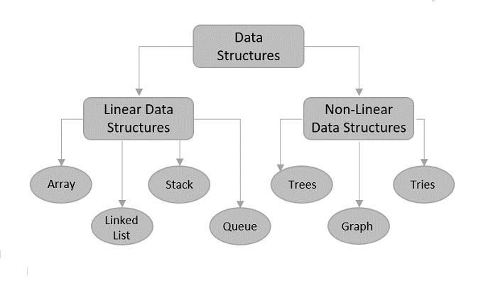

<!DOCTYPE html>
<html lang="en">
<head>
  <meta charset="UTF-8">
  <meta name="viewport" content="width=device-width, initial-scale=1.0">
  <title>Personal Portfolio</title>
  <!-- Bootstrap CSS -->
  <link href="https://stackpath.bootstrapcdn.com/bootstrap/4.5.0/css/bootstrap.min.css" rel="stylesheet">
  <!-- Custom CSS -->
  <link rel="stylesheet" href="styles.css">
</head>
<body>

  <!-- Navbar -->
  <nav class="navbar navbar-expand-lg navbar-dark bg-dark">
    <a class="navbar-brand" href="#">Arsal Farrukh</a>
    <button class="navbar-toggler" type="button" data-toggle="collapse" data-target="#navbarNav" aria-controls="navbarNav" aria-expanded="false" aria-label="Toggle navigation">
      
    </button>
    

      <ul class="navbar-nav ml-auto">
        <li class="nav-item active">
          <a class="nav-link" href="#home">Home</a>
        </li>
        <li class="nav-item">
          <a class="nav-link" href="#about">About</a>
        </li>
        <li class="nav-item">
          <a class="nav-link" href="#projects">Projects</a>
        </li>
        <li class="nav-item">
          <a class="nav-link" href="#blog">Blog</a>
        </li>
        <li class="nav-item">
          <a class="nav-link" href="#contact">Contact</a>
        </li>
      </ul>
    

  </nav>

  <!-- Home Page -->
  <section id="home" class="container mt-5">
    <h3>Hi There! My name is Arsal Farrukh, and I am an Information Technology (BA) student who is attending York University full-time. My Age is 22, and I live in Toronto, Canada. </h3>
    
    
    
   
    
  <section>

  <!-- About Me Page -->
  <section id="about" class="container mt-5">
    <h2>About Me</h2>
    
 My furthest completed education is obtaining a high school diploma. I am also, as mentioned, partway though an IT degree at York 

    
 and hope to finish by end of next year (2025). My skills so far mostly revolve around my current IT education, such as experience with

    
 coding languages, data, and computer hardware infrastructure, all of which are important in any IT field. My Interests include IT related

    
 topics. Outside this, I enjoy watching sports and playing video games. Feel free to reach out as I enjoy making connections and furthering

    
 my career. For reference, I have included my resume which I am sure will help with these goals.

    
 In conclusion, here is a summary of my skills and hobbies:

    <ul> 
     <li> Experience with coding languages such as Python, Matlab, and others</li> 
      <li> Handling data, particularly in the realm of data analytics</li>
      <li> Handling hardware related to computers, such as dealing with computer networks</li>
      <li> I enjoy playing sports and vidoe games</li>
    </ul>
    
 I have also included my resume so you can see my progress in real time. It can be downloaded as well easily for easy reference

    <h3> Here is my Resume:</h3>
   
  <iframe src="Resume Arsal Farrukh 2024.pdf" width="100%" height="500px"></iframe>
  
  
  
<a href="Resume Arsal Farrukh.pdf" class="btn btn-primary" download>Download Resume as PDF</a>

  </section>

  <!-- Projects Page -->
  <section id="projects" class="container mt-5">
    <h2>Here is a list of my projects:</h2>
   <ul>
    <li>1.Tic-Tac-Toe game: </li>
  </ul>
  
 This is a project for a class assignment that I have created in the past. It is written in the Java programming language.

  
 The basic premise was to create a Tic-Tac-Toe game that is easy to use and interactive. The user is one of the players and

  
 is essentially like playing against a computer. Here is a link of the Java File with the code for the project/assingnment:

  
<a href="GamePlayGUI (1).java">GamePlayGUI (1).java</a>

  
 This link demonstrates the full code used in a GitHub repository for easy viewing. Here is a screenshot of some of what you will be viewing in case link does not work: 

  

  <ul> 
    2. Data Structures Project:  
  </ul>
  
 This project involved creating various Data Structures, such as Linked Lists and Binary Trees, very important concepts for any IT field.

  
 The goal was to gain more experience with using the data structures, as well as to help grasp all the important topics mentioned, and to provide

  
 a smooth, interactive experience for any potential users so they can easily learn as well. Here is the Java code used for thus project:

  <a href="Main (9).java">Main (9).java</a>
  
 This link shows the Full code mentioned above in the Github repository, again, for easy reference. Here is a screenshot of of a portion of the code in case link does not work: 

  
  
  
  
    
   
    
  </section>

  <!-- Blog Page -->
  <section id="blog" class="container mt-5">
    <h2>Blog</h2>
    
Note: My Blog page will contain even more in-depth info relating to myself and my career; it will be an breathtaking experience. Stay Tuned!

    
  </section>

  <!-- Contact Page -->
  <section id="contact" class="container mt-5">
     
 I very much appreciate you taking the time to review my Website. I hope you have learned something valuable. Lastly, I would like to

    
 include my contact information for future reference. Also, feel free to include your own contact info as well. Hope you reach out!

    <h2>Contact Information</h2>

    
Feel free to <a href="mailto:arsalfarrukh96@gmail.com">contact me via email</a>.

    
Connect with me on LinkedIn: 
    <a href="https://www.linkedin.com/in/your-linkedin-username" target="_blank">
      <i class="fab fa-linkedin"></i> Your LinkedIn Name
    </a>
  

    
     
    <form>
      

        <label for="name">Name</label>
        <input type="text" class="form-control" id="name" placeholder="Enter your name">
      

      

        <label for="email">Email address</label>
        <input type="email" class="form-control" id="email" placeholder="Enter your email">
      

      

        <label for="subject">Subject</label>
        <input type="text" class="form-control" id="subject" placeholder="Enter subject">
      

      

        <label for="message">Message</label>
        <textarea class="form-control" id="message" rows="5" placeholder="Enter your message"></textarea>
      

      <button type="submit" class="btn btn-primary">Submit</button>
    </form>
  </section>

 <!-- Footer -->
<footer class="footer mt-5 py-3 bg-dark text-white">
  

    
&copy; 2024 Arsal Farrukh. Website is owned by Arsal Farrukh.

  

</footer>

  <!-- Bootstrap JS and dependencies -->
  
  
</body>
</html>
      
